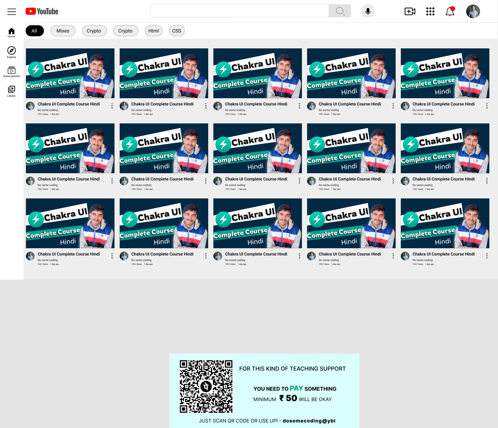

# Html-Css-Youtube-Clone-Practise-Project
Just test my HTML CSS skiils to build this small project hope its helpful for you also
# YouTube Clone

## Description

This is a simple YouTube Clone project that replicates the basic layout and functionality of YouTube's homepage. It features a side bar with navigation icons, a search bar to look for videos, and a main section displaying video cards with thumbnails, titles, and other details.

## Features

- **Side Bar:** The side bar contains navigation icons for Home, Explore, Subscription, and Library.

- **Search Bar:** Users can use the search bar to look for videos by entering keywords.

- **Video Cards:** The main section displays video cards, each containing a thumbnail, title, and details about the video.

## Technologies Used

- **HTML5:** Used to create the structure and content of the YouTube Clone.

- **CSS3:** Employed for styling and layout, ensuring a clean and visually appealing design.

## Getting Started

To view this YouTube Clone locally, follow these steps:

1. Clone the repository.
2. Open the `index.html` file in your preferred web browser.

## Deployment

This project can be deployed using any web hosting service. Simply upload the files to your web server or use one of the recommended hosting providers like GitHub Pages, Vercel, or Netlify.

## Contributions

Contributions and feedback are welcome! Feel free to open an issue or create a pull request.

## License

This project is licensed under the [MIT License](LICENSE).
